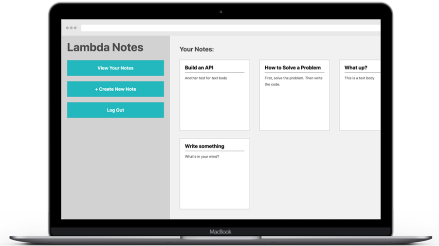

# Jordan Stoddard Portfolio:

## Introduction

Jordan Stoddard is a Full Stack Web Developer with 10 years experience in Project Management and Growth.  
In his previous career he had the opportunity to lead teams of 35+ and manage projects for some of the largest and well known companies in the world such as:
  
Google, Bank of America, VMWare, Stanford University, IBM, Greylock Realty Partners and many others.

# Projects:

## Team Project: MyHouse
 

 

### Description:
Coupled with the best machine learning algorithms in real estate technology, MyHouse’s data provides homeowners and buyers the most accurate decision making information on the market.

Tech Stack: React, React Hooks, Redux, node-sass, GraphQL, Node.js, Postgres and the Amazon Web Services Suite: Amplify, Cognito, AppSync, S3, and Elastic Beanstalk.

View the site [here](https://myhouse-lr5myrn9k.now.sh/) 
View the codebase [here](https://github.com/labs12-real-estate/labs12-real-estate-FE)

 

#

 

## Personal Project: MovieFan
 

### Description:

Explore. Discover. Remember.

MovieFan allows you to browse movies from top rated to upcoming, from old favorites to the newest releases.

Tech stack: React, React Hooks, SASS, axios, bootstrap, react-slick.

View the site [here](https://moviefanapp.online/) 
View the codebase [here](https://github.com/Jordan-Stoddard/MovieFan-2.0)

 

#

 

## Personal Project: Lambda Notes
 

### Description:
A simple note-taking web application that lets a user create, update, delete and display notes

View the site [here](https://jordan-notes.netlify.com/) 
View the codebase [here](https://github.com/Jordan-Stoddard/front-end-project-week)

 

#

 

Thank you very much. Please feel free to contact me via any of the channels below:

- [Twitter](https://twitter.com/Jdogstoddard)
- [LinkedIn](https://www.linkedin.com/in/jordan-stoddard-aa928167/)
- [Github](https://github.com/Jordan-Stoddard)
- <a href="mailto:jordan.j.stoddard@gmail.com">Email</a>

